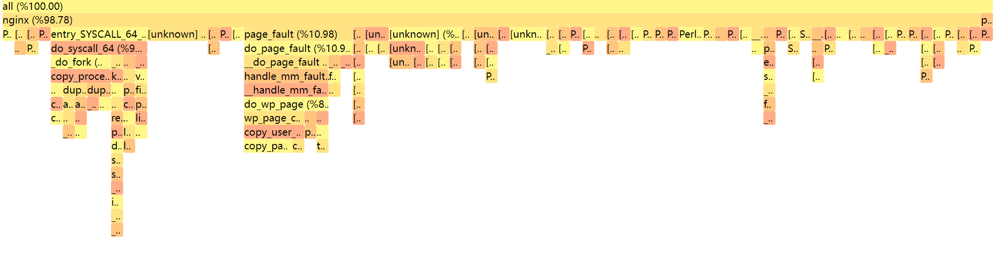

<div>

</div>

[![docs][docs-shield]][docs-url] [![version][version-shield]][version-url] 



## Sberf
Profiling & visualization tool based on eBPF

#### Quick start

Download the newest version in [Releases](https://github.com/Sberm/sberf/releases)

Usage

```bash

sudo ./sberf record <PID1>,<PID2>
# sudo ./sberf record 1001
# sudo ./sberf record 1001,32847

```

```txt

  Usage:

    sberf record [options]

  Options:

    -p[--pid]: Record running time
    -t[--tracepoint]: Record tracepoints' triggered time
    -s[--syscall]: Record stack traces when a syscall is triggered
    -m[--memory]: Record memory usage
    -op[--off-cpu]: Record OFF-CPU time
    -h[--help]: Print this help message

    -f: Frequency in Hz
    -np: No plotting, print the stacks instead
    -a: Record all processes
    -o: File name for the plot

```

#### Compilation

1. Install [bpftool](https://github.com/libbpf/bpftool)

```bash
git clone https://github.com/libbpf/bpftool.git
cd src
make
make install
```

2. Install [libbpf](https://github.com/libbpf/libbpf)

```bash
git clone https://github.com/libbpf/libbpf.git
cd src
make
make install
```

3. Install Clang

```bash
# ubuntu
sudo apt-get install clang

# centos
sudo yum install clang
```

4. Clone this repo

```bash
git clone https://github.com/Sberm/sberf.git
cd sberf
```

5. Generate vmlinux.h

```bash
# generate vmlinux.h file to vmlinux folder
bpftool btf dump file /sys/kernel/btf/vmlinux format c > vmlinux/vmlinux.h
```

6. Make

```bash
# mute
make

# verbose message
DEBUG=1 make
```

#### Files & their uses

`bpf.c` Programs that run on eBPF virtual machine

`.c` Regular c programs

#### Makefile compilation pipeline

```bash
# *.bpf.c: eBPF-c files
# *.bpf.o: eBPF target file generated by clang and bpftool (in the build_bpf folder)
# *.skel.h: skeleton header generated by bpftool, such as sberf.skel.h (in the build_bpf folder)
# *.c: regular c file, calling eBPF virtual machine through include skeleton header 
# *.o: through CC, link all regular .o files to generate sberf executable file
#
# bpf.c --Clang--> bpf.tmp.o --bpftool--> bpf.o --bpftool--> skel.h
#                                                               \_ .c --gcc--> .o
#                                                                               \_ sberf
```

[docs-shield]: https://img.shields.io/badge/docs-here-FFDB1A
[docs-url]: https://sberm.cn/sberf/docs

[version-shield]: https://img.shields.io/badge/version-v0.0.5-green
[version-url]: https://github.com/Sberm/Sberf.c/releases
